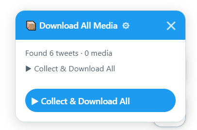
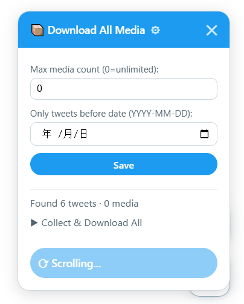
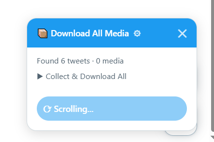
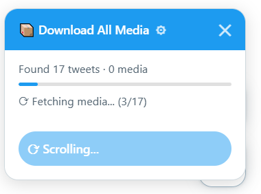
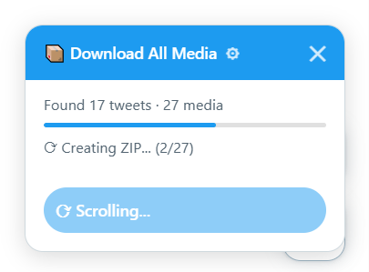
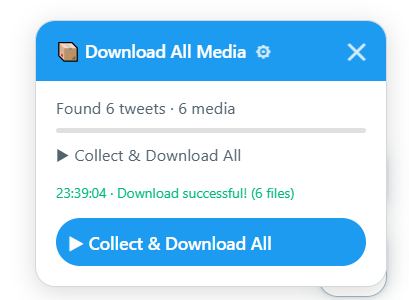

# X ページ一括ダウンローダー（いいね / メディア）

> TamperMonkey ユーザースクリプト — X (Twitter) 上のすべてのメディアをワンクリックでダウンロード。

[English](README.md) | [中文](README.zh-CN.md)

[ChinaGodMan](https://github.com/ChinaGodMan/UserScripts) のオリジナルスクリプトに感謝します!

気に入ったら GitHub で ⭐ をお願いします。

---

## 概要

X（旧 Twitter）の `/media` および `/likes` ページからすべてのメディア（画像・動画・GIF）を**一括ダウンロード**する TamperMonkey スクリプトです。

> 単一ツイート用のオリジナルスクリプトは [ChinaGodMan](https://github.com/ChinaGodMan/UserScripts) によるものです。

---

## 機能 (`x-page-downloader.user.js`)

- **一括取得** — ユーザーのメディアギャラリーやいいねしたツイートから全画像・動画・GIF を取得
- **自動スクロール** — 自動的にスクロールしてすべてのコンテンツを読み込み、新しいアイテムがなくなるか期待数に達したら停止
- **ZIP パッケージ** — すべてのファイルを 1 つの ZIP にまとめ、`{表示名}@{ユーザー名}/` フォルダに整理
- **ファイル名** — `{表示名}@{ユーザー名}_{ツイートID}_{n}.{拡張子}`（複数メディアの場合のみインデックス付加）
- **日付フィルター** — 指定した日付**より前**のツイートのみダウンロード（`YYYY-MM-DD` 形式）
- **最大数制限** — N 個のメディアで停止（0 = 無制限）
- **設定の永続化** — 最大数と日付は `GM_setValue` で保存され、ページを跨いでも有効
- **SPA ナビゲーション対応** — X 内でページ移動時に自動的に状態をリセット
- **最小化可能** — ✕ をクリックで右下に 📦 フローティングボタンとして格納
- **ダウンロードログ** — 成功/失敗メッセージをタイムスタンプ付きでパネル内に表示

### 対応ページ

| ページ | URL パターン | DOM 構造 |
|---|---|---|
| メディアギャラリー | `https://x.com/{ユーザー}/media` | `li[role="listitem"]` グリッド |
| いいね | `https://x.com/{ユーザー}/likes` | `article[data-testid="tweet"]` タイムライン |

---

## インストール

1. [TamperMonkey](https://www.tampermonkey.net/) をインストール（Chrome / Firefox / Edge）
2. 以下のスクリプトの生 URL を開く：
   - **一括ダウンロード**：[`x-page-downloader.user.js`](x-page-downloader.user.js)
   - **個別ダウンロード**：[`user.js`](user.js)
3. TamperMonkey がインストール確認を表示するので **インストール** をクリック

### 手動インストール

1. スクリプトの内容をコピー
2. TamperMonkey ダッシュボード → **新スクリプトを追加**
3. 貼り付け → **Ctrl+S** で保存

---

## 使い方

1. `https://x.com/{ユーザー名}/media` または `https://x.com/{ユーザー名}/likes` にアクセス
2. 右下にフローティングパネルが表示されます

   

3. （オプション）⚙ をクリックして設定：
   - **Max media count**：ダウンロード数を制限（0 = 無制限）
   - **Cutoff date**：この日付**より前**のツイートのみダウンロード
   - **Save** をクリック（設定は自動的に保存されます）

   

4. **▶ Collect & Download All** をクリック
5. スクリプトの動作：
   - **自動スクロール**でツイートを読み込み：

     

   - **メディア URL を取得**：

     

   - **ZIP にパッケージ**：

     

6. ダウンロード完了：

   

### ZIP 構造

```
fullname@username.zip
└── fullname@username/
    ├── fullname@username_2058540338411876579.jpg
    ├── fullname@username_2058328300595089506.jpg
    ├── fullname@username_2057214335341256995_1.jpg   (複数画像ツイート)
    ├── fullname@username_2057214335341256995_2.jpg
    └── fullname@username_2056320976921772506.mp4      (動画)
```

---

## 設定 (`x-page-downloader.user.js`)

| 設定 | 説明 | デフォルト |
|---|---|---|
| **Max media count** | 最大ダウンロードファイル数（0 = 無制限） | `0` |
| **Cutoff date** | この日付より前のツイートのみダウンロード（空欄 = フィルターなし） | `''` |

設定は `GM_setValue` で保存され、ページを跨いでも維持されます。

---

## 注意事項

- GraphQL API はハードコードされたクエリ ID（`2ICDjqPd81tulZcYrtpTuQ`）を使用しています。X 側で ID が変更された場合、スクリプトが動作しなくなる可能性があります。
- センシティブな内容のツイートも、API がメディア URL を返す限りダウンロード可能です。
- 大量のファイル（500+）をダウンロードする場合、ZIP 生成に時間がかかり、メモリを多く消費します。
- 元の個別ダウンロードスクリプト `user.js` は [ChinaGodMan](https://github.com/ChinaGodMan/UserScripts) が別途メンテナンスしています。

---

## ライセンス

MIT
